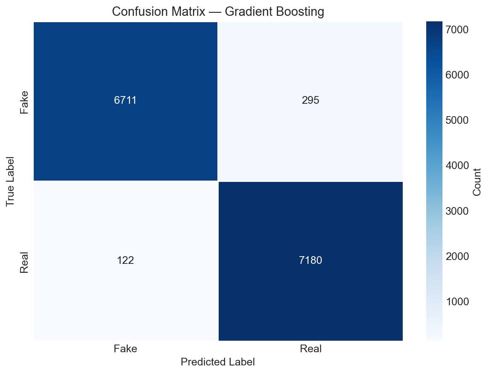
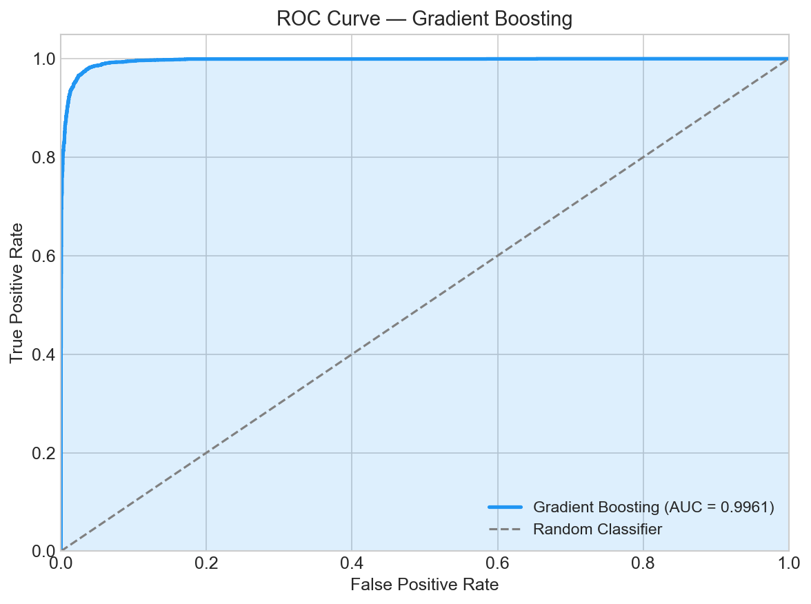

# 🚀 End-to-End Misinformation Classification Pipeline

A modular Machine Learning system that classifies news articles as **Real** or **Fake**, built to demonstrate end-to-end ML Engineering — from data ingestion and model training to experiment tracking, API serving, and containerized deployment.

**🔗 [Live Demo on Hugging Face Spaces](https://huggingface.co/spaces/AyushKanyal/Missinformation-Classifier)**

---

## 📈 Key Results

| Metric | Score |
|--------|-------|
| **Accuracy** | 97.1% |
| **F1-Score (Macro)** | 97.1% |
| **AUC-ROC** | 99.5% |
| **Inference Latency** | <40ms per article |
| **Dataset** | WELFake — 72,134 articles ([Zenodo](https://zenodo.org/record/4561253)) |
| **Best Model** | TF-IDF (50K features) + HistGradientBoosting |

## ✨ Features

- **Model Comparison Pipeline:** Trains and evaluates 5 classical ML models (Logistic Regression, Naive Bayes, Linear SVM, Random Forest, Gradient Boosting) and selects the best performer automatically.
- **Hugging Face Embeddings:** Includes an alternative pipeline using `all-MiniLM-L6-v2` SentenceTransformer embeddings for semantic text representation.
- **MLflow Experiment Tracking:** Every training run logs hyperparameters, metrics (Accuracy, F1, AUC-ROC), and model artifacts to MLflow for reproducibility.
- **FastAPI Inference Server:** Async REST API with Pydantic request validation, CORS support, and health checks.
- **Docker Containerization:** Single-command deployment via Docker.
- **CI/CD:** GitHub Actions workflow for automated testing on every push.

## 🛠️ Tech Stack

| Component | Technology |
|-----------|-----------|
| **Language** | Python 3.10+ |
| **ML Frameworks** | scikit-learn, SentenceTransformers (Hugging Face) |
| **MLOps** | MLflow |
| **API Backend** | FastAPI, Uvicorn, Pydantic |
| **Deployment** | Docker, Render (API), Hugging Face Spaces (UI) |
| **Data & NLP** | Pandas, NumPy, NLTK |
| **Testing & CI** | Pytest, GitHub Actions |

## 🏗️ Architecture

```
┌──────────────────┐       HTTP POST        ┌──────────────────────┐
│  Hugging Face    │  ──────────────────►   │  Render (FastAPI)    │
│  Spaces (Gradio) │  ◄──────────────────   │                      │
│  [Frontend UI]   │       JSON response    │  TextPreprocessor    │
└──────────────────┘                        │  → TF-IDF (50K feat) │
                                            │  → HistGBM Classifier│
                                            └──────────────────────┘
```

## 📸 Evaluation Visuals

| Confusion Matrix | ROC Curve |
| :---: | :---: |
|  |  |

## 💻 How to Run Locally

### 1. Clone & Install
```bash
git clone https://github.com/AyushKanyal-me/Fake-News-Detector.git
cd Fake-News-Detector
python -m venv .venv
source .venv/bin/activate
pip install -r requirements.txt
```

### 2. Train Models
```bash
# Train all 5 classical ML models and auto-select the best
python main.py --step all_classical

# (Optional) Train the Hugging Face embedding model
python main.py --step train_hf
```

### 3. Evaluate & Generate Reports
```bash
python main.py --step eval
```

### 4. Start the API Server
```bash
python main.py --step api
```
Visit `http://localhost:8000/docs` for the interactive Swagger UI.

## 🐳 Docker

```bash
docker build -t misinformation-classifier .
docker run -p 8000:8000 misinformation-classifier
```

## ⚠️ Limitations & Known Issues

This model was trained on the **WELFake dataset**, which merges articles from Kaggle, McIntire, Reuters, and BuzzFeed Political (published pre-2020). As a result:

- **Style Bias, Not Fact-Checking:** The TF-IDF model learns *writing style patterns* (e.g., clickbait vs. formal Reuters prose), not whether the facts in the article are actually true. It does not have access to external knowledge or the internet.
- **Distribution Shift:** Articles from sources the model has never seen (e.g., CNN, BBC, Al Jazeera) may be misclassified because their writing style differs from the training data. This is a well-known ML problem called *out-of-distribution generalization*.
- **Short Text:** The model was trained on full-length articles. Single-sentence headlines produce sparse TF-IDF vectors and unreliable predictions.

**Potential improvements:** Fine-tuning a pre-trained language model (e.g., BERT, RoBERTa) on a more diverse, up-to-date dataset would significantly improve generalization to unseen news sources.

## 📊 Models Evaluated

| Model | Accuracy | F1 (Macro) |
|-------|----------|------------|
| Logistic Regression | 96.2% | 96.2% |
| Multinomial Naive Bayes | 93.8% | 93.8% |
| Linear SVM (SGD) | 96.5% | 96.5% |
| Random Forest | 95.4% | 95.4% |
| **HistGradientBoosting** ★ | **97.1%** | **97.1%** |

> **Note:** The `data/` and `models/` directories are excluded from version control due to size. Running `main.py --step all_classical` will auto-download the dataset and generate models.
